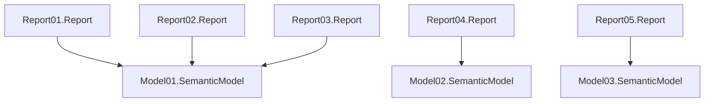

[](https://github.com/RuiRomano/pbip-demo/actions/workflows/bpa.yml) [](https://github.com/RuiRomano/pbip-demo/actions/workflows/deploy.yml) 

This repository showcases a Power BI Project (PBIP) folder structure in the [src folder](./src/), featuring multiple reports and semantic models.



It also demonstrates how to PBIP to a Fabric workspace using [Fabric CRUD REST APIs](https://learn.microsoft.com/en-us/rest/api/fabric/articles/item-management/item-management-overview) together with [fabric-cicd](https://microsoft.github.io/fabric-cicd/latest/) and run how to automatically [run best practice analysis](#run-best-practice-analysis).

## Deployment with Github Actions and fabric-cicd

- Fork the repo.
- Create a [Service Principal](https://learn.microsoft.com/en-us/rest/api/fabric/articles/get-started/create-entra-app) and configure required [Github secrets and variables](#secrets-and-variables) in your repo if you wish to test deployment from GitHub.
- Create the target Fabric Workspace and add the service principal as Admin.
- Run the [deploy](/.github/workflows/deploy.yml) Github action to deploy content to the workspace.

### Secrets and variables

Before running the Github Action, ensure you configure the following [GitHub action secrets and variables](https://docs.github.com/en/actions/security-for-github-actions/security-guides/using-secrets-in-github-actions):

| Name            | Type   | Value                |
|-----------------|--------|----------------------|
| `FABRIC_CLIENT_ID`       | Secret | [Service Principal](https://learn.microsoft.com/en-us/entra/identity-platform/howto-create-service-principal-portal) client ID from your tenant   |
| `FABRIC_CLIENT_SECRET`   | Secret | Service Principal secret |
| `FABRIC_TENANT_ID` | Secret | Your tenant ID |

## Local deployment with script and fabric-cicd

- Make sure you have the [Fabric CICD](https://microsoft.github.io/fabric-cicd/latest/) installed. If not, run:
    ```bash
    $ pip install fabric-cicd 
    ```
- Create the target Fabric Workspace
- Run the [deploy.py](./src/deploy.py)

## Run Best Practice Analysis

- Manually [bpa](/.github/workflows/bpa.yml) Github action or after a pull-request against main branch
- You can also run locally by running the script [bpa.ps1](/.bpa/bpa.ps1)

## GitHub Copilot

You can use [GitHub Copilot](https://code.visualstudio.com/docs/copilot/overview) to modify your PBIP files more efficiently—for example, by setting descriptions across all semantic model objects. This project includes a [copilot-instructions.md](./.github/copilot-instructions.md) file that guides Copilot to work more effectively with TMDL files.
